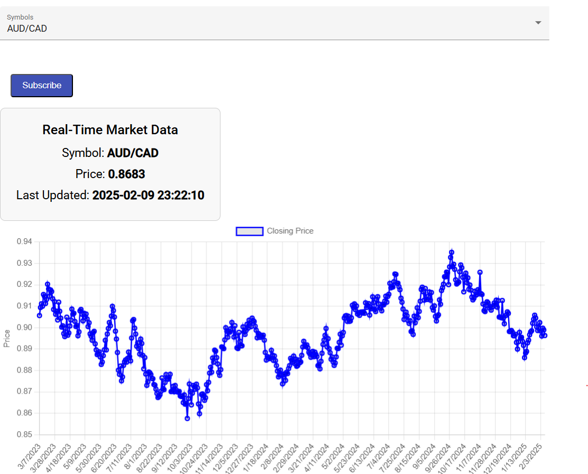

## Real-Time Market Data UI

This application provides real-time market data for selected currency pairs, including current prices and historical trends displayed as a chart.

## API Integration

To enable API calls, the plugin Allow CORS: `Access-Control-Allow-Origin` was used during development.
Note: For production, it is recommended to configure a proxy server to securely manage API requests. This ensures enhanced security and better compatibility.

## Environment Variables
To secure sensitive data, the application uses environment variables for configuration. Add the following variables to your .env file:
`client_id=your-client-id
username=your-username
password=your-password`

Access these variables in your code securely:
`client_id: environment.client_id,
username: environment.username,
password: environment.password`
This ensures that sensitive information like API credentials is not hardcoded into the source code.

## UI Result
The following image demonstrates the application's real-time market data display for AUD/CAD:

## Development server

Run `ng serve` for a dev server. Navigate to `http://localhost:4200/`. The application will automatically reload if you change any of the source files.

## Code scaffolding

Run `ng generate component component-name` to generate a new component. You can also use `ng generate directive|pipe|service|class|guard|interface|enum|module`.

## Build

Run `ng build` to build the project. The build artifacts will be stored in the `dist/` directory.

## Running unit tests

Run `ng test` to execute the unit tests via [Karma](https://karma-runner.github.io).

## Running end-to-end tests

Run `ng e2e` to execute the end-to-end tests via a platform of your choice. To use this command, you need to first add a package that implements end-to-end testing capabilities.
